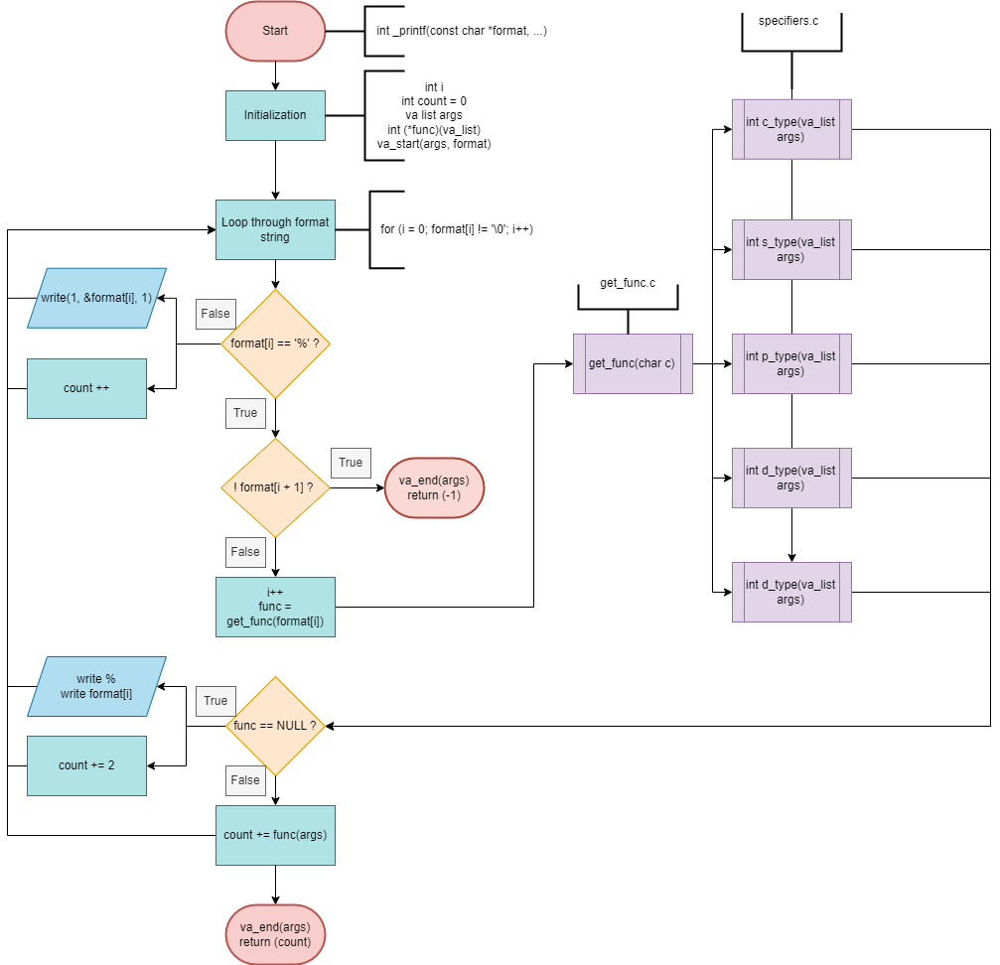

markdown
# C - printf project

<div align="center"></div>

## 📌 Description

`_printf` is a custom-built implementation of the standard C library function `printf`.  
This version was developed as part of a low-level programming project to reinforce concepts like:

- Variadic functions (`va_list`, `va_start`, `va_arg`)
- Modularity in C (separating logic into different files)
- Handling format specifiers manually
- File I/O using `write()`

It mimics some of the core functionalities of the standard `printf`, focusing on custom formatting output.

---

## 🗃️ File Structure

```
.
├── _printf.c         # Core function parsing format string
├── get_func.c        # Dispatcher for format specifiers
├── specifiers.c      # Handler functions (%c, %s, %d, etc.)
├── main.h            # Header file with prototypes
├── test_printf       # Sample test output
├── tests/
│   └── main.c        # Example test cases
├── man_3_printf.3    # Manual page (man printf)
├── .gitignore
└── README.md
```

---

## ⚙️ Compilation

You can compile this project using `gcc`:

```bash
gcc -Wall -Wextra -Werror -pedantic -std=gnu89 -Wno-format _printf.c specifiers.c get_func.c tests/main.c -o test_printf
```

---

## ▶️ Usage

Here are some examples of how to use `_printf`:

```c
_printf("Character:[%c]\n", 'H');
_printf("String:[%s]\n", "I am a string !");
_printf("Negative:[%d]\n", -762534);
```

### ✅ Output:
```
Character: [H]
String: [I am a string !]
Negative: [-762534]
```

---

## 📚 Supported Format Specifiers

| Specifier | Description              |
|-----------|--------------------------|
| `%c`      | Prints a character       |
| `%s`      | Prints a string          |
| `%%`      | Prints the percent sign  |
| `%d`/`%i` | Prints an integer        |

---

## 🧠 Logic Flowchart

Below is the visual flow of how `_printf()` handles the format string and dispatches the correct function:

> _Click on the image or open in draw.io for full resolution._



---

## 📖 Man Page

You can open the man page using:

```bash
man _printf
```

Or read it directly:

> Excerpt from the man page:

```
_printf - produce output according to a format

Synopsis:
    _printf(const char *format, ...);

Description:
    The _printf function produces output according to the format specified in the format string.
    Supported specifiers:
      - c  : character
      - s  : string
      - %  : literal '%'
      - d/i: integer
```

---

## 👨‍💻 Authors

- Jules & Fjolla / GitHub: [@Jules-github](https://github.com/Roullito) [@Fjolla-github](https://github.com/f-qrm)

---
