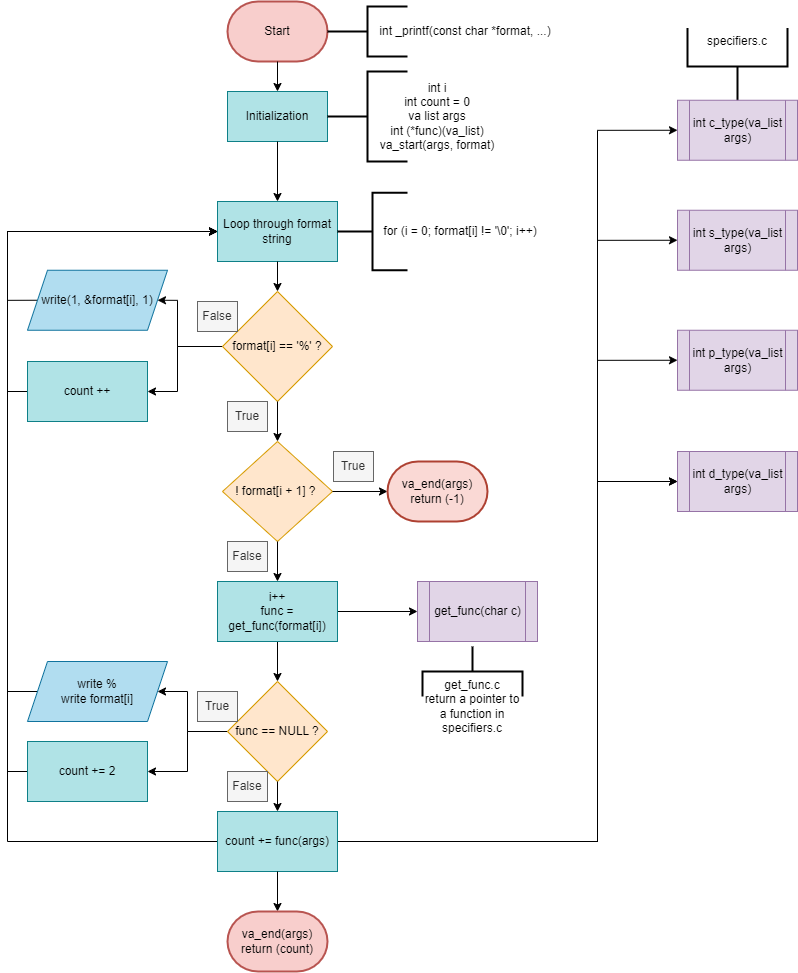

markdown
# C - printf project

<div align="center"></div>

## 📌 Description

`_printf` is a custom-built implementation of the standard C library function `printf`.  
This version was developed as part of a low-level programming project to reinforce concepts like:

- Variadic functions (`va_list`, `va_start`, `va_arg`)
- Modularity in C (separating logic into different files)
- Handling format specifiers manually
- File I/O using `write()`

It mimics some of the core functionalities of the standard `printf`, focusing on custom formatting output.

## Requirements

- Allowed editors: vi, vim, emacs
- All your files will be compiled on Ubuntu 20.04 LTS using gcc, using the options -Wall -Werror -Wextra -pedantic -std=gnu89
- All your files should end with a new line
- A README.md file, at the root of the folder of the project is mandatory
- Your code should use the Betty style. It will be checked using betty-style.pl and betty-doc.pl
- You are not allowed to use global variables
- No more than 5 functions per file
- In the following examples, the main.c files are shown as examples. You can use them to test your functions, but you don’t have to push them to your repo (if you 
  do we won’t take them into account). We will use our own main.c files at compilation; do not push your own main.c file. Our main.c files might be different from 
  the one shown in the examples
- The prototypes of all your functions should be included in your header file called main.h
- Don’t forget to push your header file
- All your header files should be include guarded

### GitHub

There should be one project repository per group. If you clone/fork/whatever a project repository with the same name before the second deadline, you risk a 0% score.

## More Info

Authorized functions and macros
write (man 2 write)
malloc (man 3 malloc)
free (man 3 free)
va_start (man 3 va_start)
va_end (man 3 va_end)
va_copy (man 3 va_copy)
va_arg (man 3 va_arg)
---

## 🗃️ File Structure

```
.
├── _printf.c         # Core function parsing format string
├── get_func.c        # Dispatcher for format specifiers
├── specifiers.c      # Handler functions (%c, %s, %d, etc.)
├── main.h            # Header file with prototypes
├── test_printf       # Sample test output
├── tests/
│   └── main.c        # Example test cases
├── man_3_printf.3    # Manual page (man printf)
├── .gitignore
└── README.md
```

---

## ⚙️ Compilation

You can compile this project using `gcc`:

```bash
gcc -Wall -Wextra -Werror -pedantic -std=gnu89 -Wno-format _printf.c specifiers.c get_func.c tests/main.c -o test_printf
```

---

## ▶️ Usage

Here are some examples of how to use `_printf`:

```c
_printf("Character:[%c]\n", 'H');
_printf("String:[%s]\n", "I am a string !");
_printf("Negative:[%d]\n", -762534);
```

### ✅ Output:
```
Character: [H]
String: [I am a string !]
Negative: [-762534]
```

---

## 📚 Supported Format Specifiers

| Specifier | Description              |
|-----------|--------------------------|
| `%c`      | Prints a character       |
| `%s`      | Prints a string          |
| `%%`      | Prints the percent sign  |
| `%d`/`%i` | Prints an integer        |

---

## 🧠 Logic Flowchart

Below is the visual flow of how `_printf()` handles the format string and dispatches the correct function:

> _Click on the image or open in draw.io for full resolution._



---

## 📖 Man Page

You can open the man page using:

```bash
man _printf
```

Or read it directly:

> Excerpt from the man page:

```
_printf - produce output according to a format

Synopsis:
    _printf(const char *format, ...);

Description:
    The _printf function produces output according to the format specified in the format string.
    Supported specifiers:
      - c  : character
      - s  : string
      - %  : literal '%'
      - d/i: integer
```

---

## 👨‍💻 Authors

- Jules & Fjolla / GitHub: [@Jules-github](https://github.com/Roullito) [@Fjolla-github](https://github.com/f-qrm)

---
